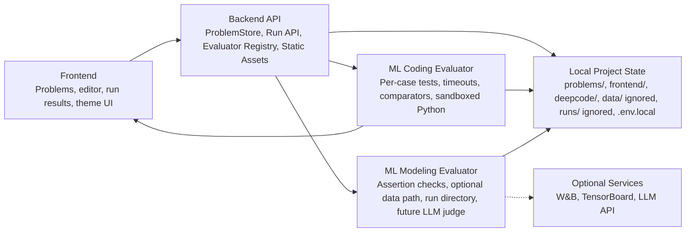

# DeepCode Architecture

This chart captures the intended system boundary: ML coding problems and small
modeling checks run through separate local evaluator paths, while larger
dataset-backed training tasks can expand the modeling path later.

## Maintainer Diagram

## Boundaries

- `frontend/` owns the browser experience.
- `deepcode/` owns the server, API routing, problem loading, and evaluator dispatch.
- `problems/` owns committed problem metadata and visible tests.
- `data/`, `runs/`, and `.env.local` are local-only and ignored by git.
- Future modeling evaluators should write metrics, logs, checkpoints, and judge inputs to local run folders unless an optional service is explicitly configured.
